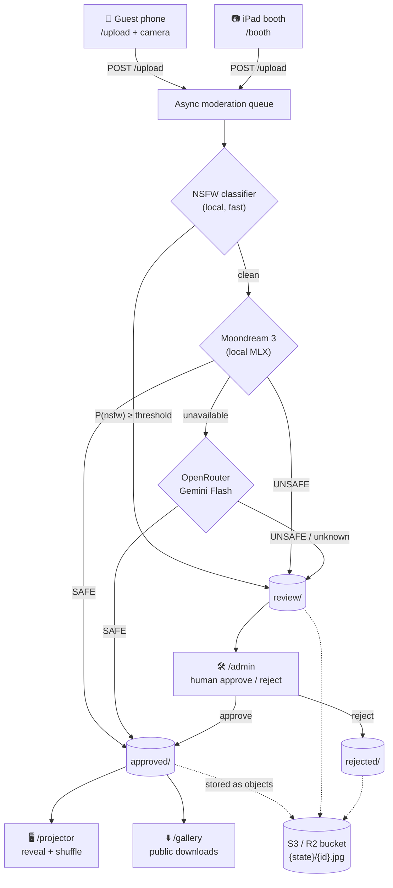

# Live Wedding Slideshow & VLM Moderation Harness

Local-first photo moderation + live projector slideshow for any event. Set the
event name, venue, date, and domain in `.env` — nothing is hardcoded.

Guests scan a QR code, upload phone photos (and an iPad photo booth posts
captures). Each image is screened **on-device** — a dedicated NSFW classifier
plus **Moondream 3** (via MLX on Apple Silicon) — and approved images are
broadcast to a projector in real time over WebSockets. Anything flagged is held
in an admin review queue. Photos live in S3-compatible object storage (R2/MinIO).



## Requirements
- Apple Silicon Mac (M-series), macOS 13+, 16GB+ unified memory
- [`uv`](https://docs.astral.sh/uv/) and Python 3.12 (pinned in `.python-version`)

## Setup
```bash
# Web stack (enough to run the harness and tests):
uv sync

# On the Mac, also pull the vision engine (downloads Moondream 3 weights on first run):
uv sync --extra vlm

# Configure:
cp .env.example .env
#   REQUIRED: set SLIDESHOW_ADMIN_TOKEN and the object-storage vars (SLIDESHOW_ARCHIVE_*
#   — see "Object storage" below; the app won't start without a bucket).
#   Optional: SLIDESHOW_OPENROUTER_API_KEY for the cloud moderation fallback.
```

## Run
The app runs **native** (MLX needs the Apple GPU — it can't run in Docker on a
Mac). A `Makefile` ties it together:
```bash
make setup     # uv sync --extra vlm + create .env
make up        # run the app (native)               <- the "just go"
make tunnel    # in a second tab: the public HTTPS tunnel
make test      # run the suite
make qr        # generate the table-card QR
```
Or run the app directly:
```bash
uv run uvicorn app.main:app --host 0.0.0.0 --port 8000
```
> Photos are stored in object storage (R2/MinIO) — see **Object storage** below;
> the app won't start until a bucket is configured.

## Moderation chain
0. **Dedicated NSFW classifier (local)** — a purpose-built image classifier
   (`SLIDESHOW_NSFW_MODEL_ID`, default `Marqo/nsfw-image-detection-384`) runs first
   on the Apple GPU. If `P(nsfw) >= SLIDESHOW_NSFW_THRESHOLD` (default 0.5) the photo
   is held immediately — this is the reliable nudity gate.
1. **Moondream 3, local (MLX/Metal)** — catches the rest (obscene gestures,
   violence, gore) with `reasoning=True`. Weights: `SLIDESHOW_MODEL_ID`.
2. **OpenRouter Gemini Flash** — cloud fallback when the local VLM is
   unavailable. Set `SLIDESHOW_OPENROUTER_API_KEY` to enable.
3. If nothing can classify it, the photo is **held in the review queue** —
   nothing unmoderated ever reaches the projector.

Defense-in-depth: a photo is held if **either** the NSFW classifier **or** the
VLM flags it.

> ⚠️ **Privacy:** the OpenRouter fallback sends guest images to a third party
> (Google, via OpenRouter). It only triggers when the local model is down. Leave
> `SLIDESHOW_OPENROUTER_API_KEY` blank to keep everything 100% on-device.

## Pages at a glance
- `/upload` — guest upload (QR target)
- `/booth` — iPad photo booth kiosk (needs HTTPS — use the tunnel URL)
- `/projector` — fullscreen slideshow
- `/gallery` — **public** download gallery (browse + per-photo download + "Download all" zip)
- `/admin?token=…` — review queue

## Download gallery
`/gallery` lists every approved photo with individual downloads and a
`Download all` zip (`/gallery/all.zip`). It's public — share
`https://<your-domain.com>/gallery` with guests after the event.

## Object storage (the photo store — REQUIRED)
**All** photos live in S3-compatible object storage — there is no local `data/`
directory. Each photo is an object `{state}/{id}.jpg` with a `{id}.json` sidecar;
state changes are a server-side copy+delete. The app proxies image bytes to the
projector/gallery/admin through `/media` (only the app is exposed via the tunnel,
not the bucket). Set the bucket/creds in `.env` (the `SLIDESHOW_ARCHIVE_*` vars).

**Cloudflare R2 (recommended — off-machine, no egress fees):**
```
SLIDESHOW_ARCHIVE_BUCKET=<your-bucket>
SLIDESHOW_ARCHIVE_ENDPOINT_URL=https://<accountid>.r2.cloudflarestorage.com
SLIDESHOW_ARCHIVE_REGION=auto
SLIDESHOW_ARCHIVE_ACCESS_KEY_ID=<r2 access key id>
SLIDESHOW_ARCHIVE_SECRET_ACCESS_KEY=<r2 secret>
```
Create the keys in Cloudflare → **R2 → Manage R2 API Tokens** (Object Read & Write).

**MinIO (self-hosted alternative)** via Docker — `docker compose up -d` starts it
and auto-creates the bucket; set `SLIDESHOW_ARCHIVE_ENDPOINT_URL=http://localhost:9000`,
`SLIDESHOW_ARCHIVE_REGION=us-east-1`, creds `minioadmin`/`minioadmin`. Console at
`http://localhost:9001`. (Same laptop, so use R2 for true off-machine durability.)

The bucket is auto-created on startup if missing. Confirm it's live at `/healthz`
(the `storage` block) and watch for `APPROVED … -> s3://…` activity.

## QR code for table cards
```bash
uv run python scripts/generate_qr.py   # writes wedding_slideshow_qr.{svg,png}
```

## Cloudflare Tunnel (public ingress)
```bash
cp config/cloudflared.example.yml config/cloudflared.yml   # then edit it
cloudflared tunnel login
cloudflared tunnel create <tunnel-name>
cloudflared tunnel route dns <tunnel-name> <your-domain.com>
cloudflared tunnel --config config/cloudflared.yml run     # or: make tunnel
```
`config/cloudflared.yml` is git-ignored (it holds your tunnel id + creds path) —
copy it from `config/cloudflared.example.yml`.

## Tests
```bash
uv run pytest        # runs without model weights (stubbed moderator)
```

## Day-of checklist
1. `uv sync --extra vlm` and confirm `/healthz` shows `moondream` available.
2. MacBook on Ethernet to the dedicated router; iPad booth on that SSID.
3. HDMI to projector; open `/projector` in Chrome, go fullscreen.
4. Start the tunnel; load `https://<your-domain.com>/upload` from a phone.
5. Open `/admin?token=…` on a second screen and keep an eye on the queue.
6. Print `wedding_slideshow_qr.svg` on the table cards.

## Layout
```
app/         FastAPI app, moderation, storage, queue, templates
static/      css + vanilla JS (upload, booth, projector, admin)
scripts/     generate_qr.py, test_moderation.py (threshold tuning)
config/      cloudflared.example.yml (copy to cloudflared.yml)
models/      downloaded model weights (local cache)
             (photos live in S3 object storage: {state}/{id}.jpg + {id}.json)
```
